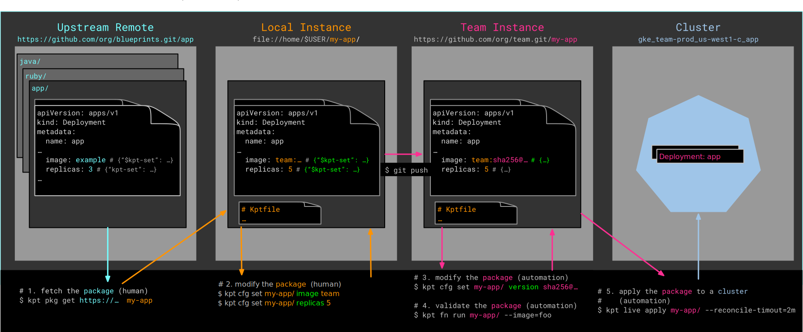
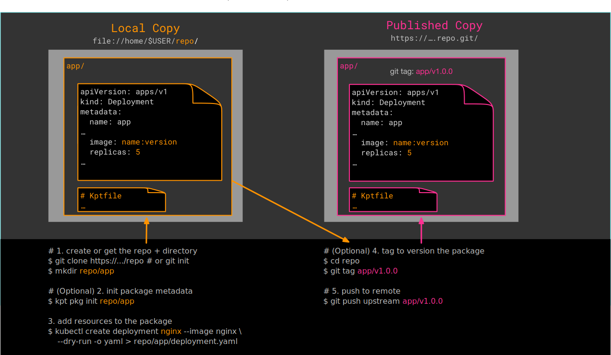

### For Consumers

The following are guides for workflows related to consuming packages published by other
teams or organizations.

- [Get](guides/consumer/get/)
- [Display](guides/consumer/display/)
- [Set](guides/consumer/set/)
- [Substitute](guides/consumer/substitute/)
- [Apply](guides/consumer/apply/)
- [Update](guides/consumer/update/)
- [Subpackages](guides/consumer/subpackages/)

### For Producers

The following are guides for publishing configuration packages for others to consume.

- [Init](guides/producer/init/)
- [Setters](guides/producer/setters/)
- [Substitution](guides/producer/substitutions/)
- [Packages](guides/producer/packages/)
- [Bootstrapping](guides/producer/bootstrap/)
- [Subpackages](guides/producer/subpackages/)