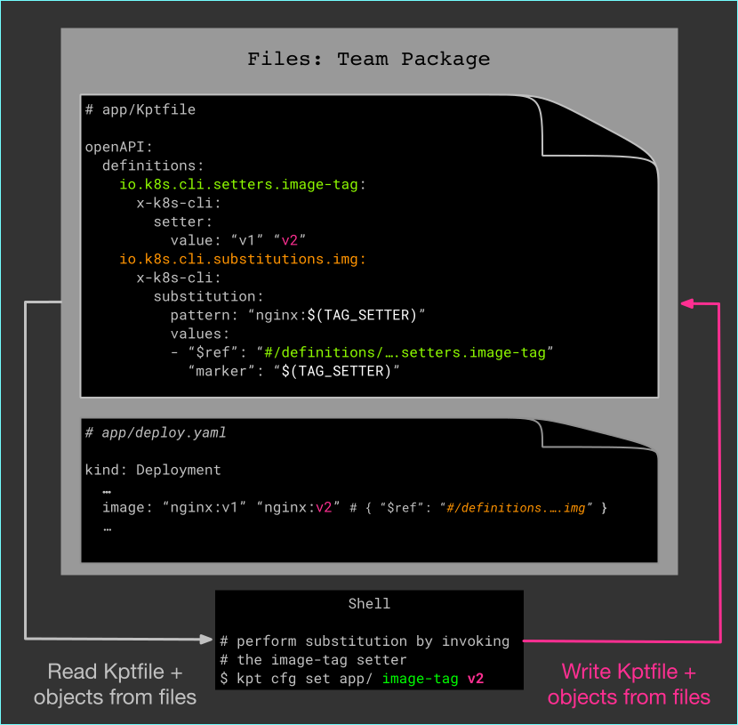

# Create high-level substitutions to provide substitute field values using setters.


Substitutions provide a solution for template-free substitution of field values
built on top of [setters].  They enable substituting values into part of a
field, including combining multiple setters into a single value.

Much like setters, substitutions are defined using OpenAPI.

Substitutions may be invoked to programmatically modify the configuration
using `kpt cfg set` to substitute values which are derived from the setter.

Substitutions are computed by substituting setter values into a pattern.
They are composed of 2 parts: a pattern and a list of values.

- The pattern is a string containing markers which will be replaced with
  1 or more setter values.
- The values are pairs of markers and setter references.  The *set* command
  retrieves the values from the referenced setters, and replaces the markers
  with the setter values.

Creating a substitution requires that the package has a Kptfile.  If one does
not exist for the package, run `kpt pkg init DIR/` to create one.


## Substitutions explained

Following is a short explanation of the command that will be demonstrated
in this guide.

### Data model

- Fields reference substitutions through OpenAPI definitions specified as
  line comments -- e.g. `# { "$kpt-set": "substitution" }`
- OpenAPI definitions are provided through the Kptfile
- Substitution OpenAPI definitions contain patterns and values to compute
  the field value

### Command control flow

1. Read the package Kptfile and resources.
2. Change the setter OpenAPI value in the Kptfile
3. Locate all fields which reference the setter indirectly through a
   substitution.
4. Compute the new substitution value by substituting the setter values into
   the pattern.
5. Write both the modified Kptfile and resources back to the package.



## Creating a Substitution

Substitution may be created either manually (by editing the Kptfile directly),
or programmatically (with `create-subst`).  The `create-subst` command will:

1. Create a new OpenAPI definition for a substitution in the Kptfile
2. Create references to the substitution OpenAPI definition on the resource
   fields

### Example

```yaml
# deployment.yaml -- original
kind: Deployment
metadata:
  name: foo
spec:
  template:
    spec:
      containers:
      - name: nginx
        image: nginx:1.7.9 # {"$kpt-set":"image-value"}
```

```sh
# create an image substitution and a setter that populates it
kpt cfg create-subst hello-world/ image-value --field-value nginx:1.7.9 \
  --pattern nginx:\${TAG_SETTER}
```

```yaml
# Kptfile -- updated
openAPI:
  definitions:
    io.k8s.cli.setters.TAG_SETTER:
      x-k8s-cli:
        setter:
          name: TAG_SETTER
          value: 1.7.9
    io.k8s.cli.substitutions.image-value:
      x-k8s-cli:
        substitution:
          name: image-value
          pattern: nginx:${TAG_SETTER}
          values:
          - marker: ${TAG_SETTER}
            ref: '#/definitions/io.k8s.cli.setters.TAG_SETTER'
```

```yaml
# deployment.yaml -- updated
kind: Deployment
metadata:
  name: foo
spec:
  template:
    spec:
      containers:
      - name: nginx
        image: nginx:1.7.9 # {"$kpt-set":"image-value"}
```

This substitution defines how the value for a field may be produced by
substituting the `tag` setter value into the pattern.

Any time the `tag` value is changed via the *set* command, then then
substitution value will be re-calculated for referencing fields.

## Creation semantics

By default create-subst will create referenced setters if they do not already
exist.  It will infer the current setter value from the pattern and value.

If setters already exist before running the create-subst command, then those
setters are used and left unmodified.

If a setter does not exist and create-subst cannot infer the setter value,
then it will throw and error, and the setter must be manually created.

## Invoking a Substitution

Substitutions are invoked by running `kpt cfg set` on a setter used by the
substitution.

```sh
kpt cfg set hello-world/ TAG_SETTER 1.8.1
```

```yaml
# deployment.yaml -- updated
kind: Deployment
metadata:
  name: foo
spec:
  template:
    spec:
      containers:
      - name: nginx
        image: nginx:1.8.1 # {"$kpt-set":"image-value"}
```

## Nested Substitutions

In addition to referring to setters, a substitution may also refer to another
substitution forming a tree structure. Upon invoking `kpt cfg set` on a setter,
the value will be set if a substitution is an ancestor/parent of the setter.

Here is the example of a simple setter and a substitution to start with

```yaml
apiVersion: apps/v1
kind: Deployment
metadata:
  name: nginx-deployment
  namespace: myspace # {"$kpt-set":"namespace-setter"}
spec:
  replicas: 3
  template:
    spec:
      containers:
      - name: sidecar
        image: nginx:1.7.9 # {"$kpt-set":"image-subst"}
      - name: nginx
        image: myspace/nginx:1.7.9
```

```yaml
apiVersion: v1alpha1
kind: Kptfile
openAPI:
  definitions:
    io.k8s.cli.setters.namespace-setter:
      x-k8s-cli:
        setter:
          name: namespace-setter
          value: myspace
    io.k8s.cli.setters.image-setter:
      x-k8s-cli:
        setter:
          name: image-setter
          value: nginx
    io.k8s.cli.setters.tag-setter:
      x-k8s-cli:
        setter:
          name: tag-setter
          value: 1.7.9
    io.k8s.cli.substitutions.image-subst:
      x-k8s-cli:
        substitution:
          name: image-subst
          pattern: ${image-setter}:${tag-setter}
          values:
          - marker: ${image-setter}
            ref: '#/definitions/io.k8s.cli.setters.image-setter'
          - marker: ${tag-setter}
            ref: '#/definitions/io.k8s.cli.setters.tag-setter'
```

Now create a nested substitution for the value `myspace/nginx:1.7.9` which is
a combination of `namespace-setter` and `image-subst`

```sh
kpt cfg create-subst hello-world/ nested-subst --field-value myspace/nginx:1.7.9 \
  --pattern \${namespace-setter}/\${image-subst}
```

```yaml
# deployment.yaml -- updated
apiVersion: apps/v1
kind: Deployment
metadata:
  name: nginx-deployment
  namespace: myspace # {"$kpt-set":"namespace-setter"}
spec:
  replicas: 3
  template:
    spec:
      containers:
      - name: sidecar
        image: nginx:1.7.9 # {"$kpt-set":"image-subst"}
      - name: nginx
        image: myspace/nginx:1.7.9 # {"$kpt-set":"nested-subst"}
```

```yaml
# Kptfile -- updated
apiVersion: v1alpha1
kind: Kptfile
openAPI:
  definitions:
    io.k8s.cli.setters.namespace-setter:
      x-k8s-cli:
        setter:
          name: namespace-setter
          value: myspace
    io.k8s.cli.setters.image-setter:
      x-k8s-cli:
        setter:
          name: image-setter
          value: nginx
    io.k8s.cli.setters.tag-setter:
      x-k8s-cli:
        setter:
          name: tag-setter
          value: 1.7.9
    io.k8s.cli.substitutions.image-subst:
      x-k8s-cli:
        substitution:
          name: image-subst
          pattern: ${image-setter}:${tag-setter}
          values:
          - marker: ${image-setter}
            ref: '#/definitions/io.k8s.cli.setters.image-setter'
          - marker: ${tag-setter}
            ref: '#/definitions/io.k8s.cli.setters.tag-setter'
    io.k8s.cli.substitutions.nested-subst:
      x-k8s-cli:
        substitution:
          name: nested-subst
          pattern: ${namespace-setter}/${image-subst}
          values:
          - marker: ${image-subst}
            ref: '#/definitions/io.k8s.cli.substitutions.image-subst'
          - marker: ${namespace-setter}
            ref: '#/definitions/io.k8s.cli.setters.namespace-setter'
```

```sh
kpt cfg set hello-world/ namespace-setter otherspace
```

```yaml
# deployment.yaml -- updated
apiVersion: apps/v1
kind: Deployment
metadata:
  name: nginx-deployment
  namespace: otherspace # {"$kpt-set":"namespace-setter"}
spec:
  replicas: 3
  template:
    spec:
      containers:
      - name: sidecar
        image: nginx:1.7.9 # {"$kpt-set":"image-subst"}
      - name: nginx
        image: otherspace/nginx:1.7.9 # {"$kpt-set":"nested-subst"}
```

When setting a field through a substitution, the names of the setters
are used *not* the name of the substitution.  The name of the substitution is
*only used in the configuration field references*.

[setters]: ../setters/
